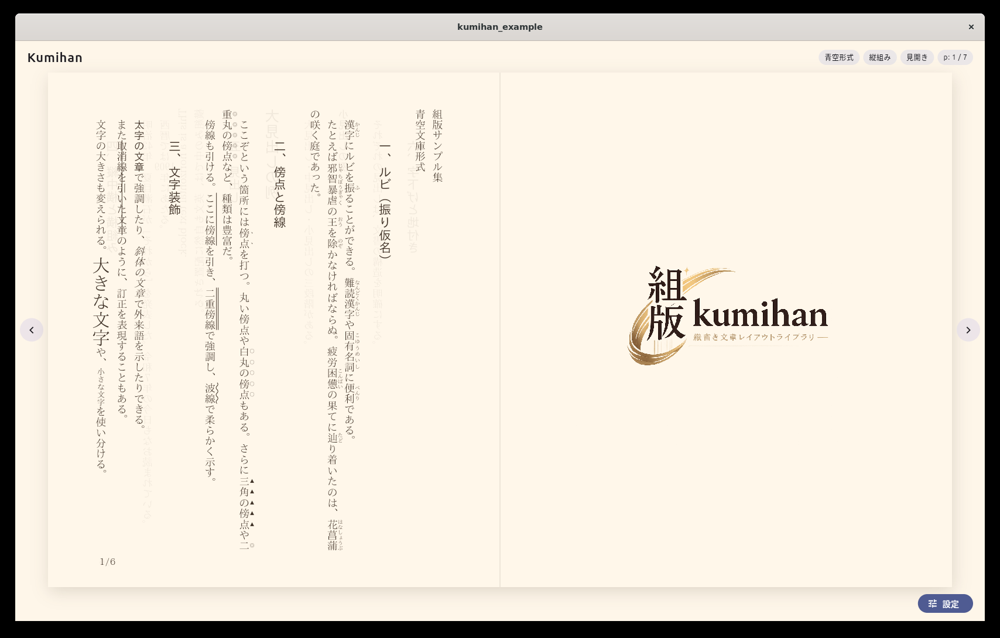
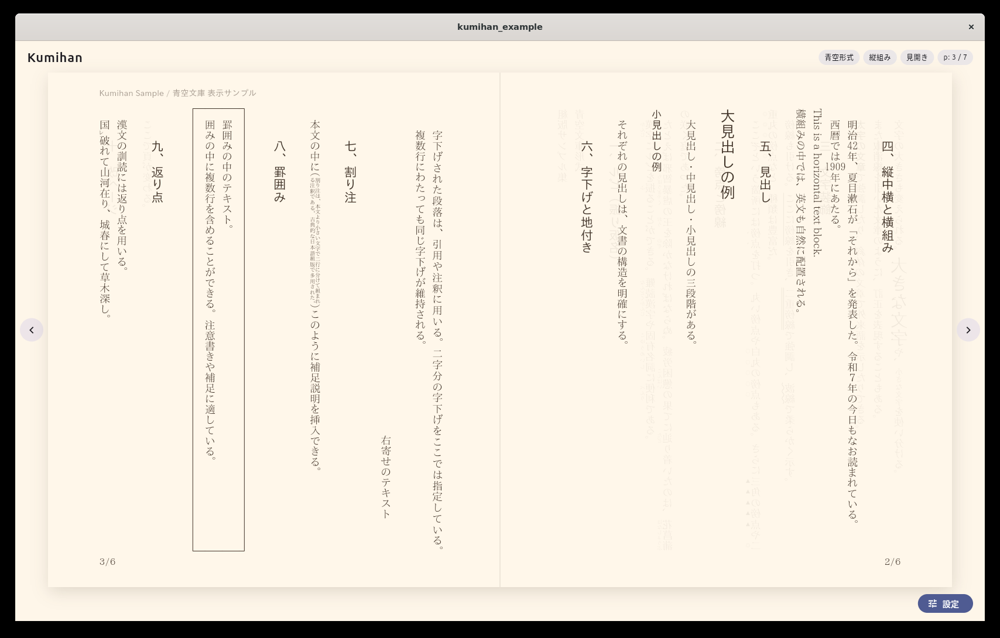
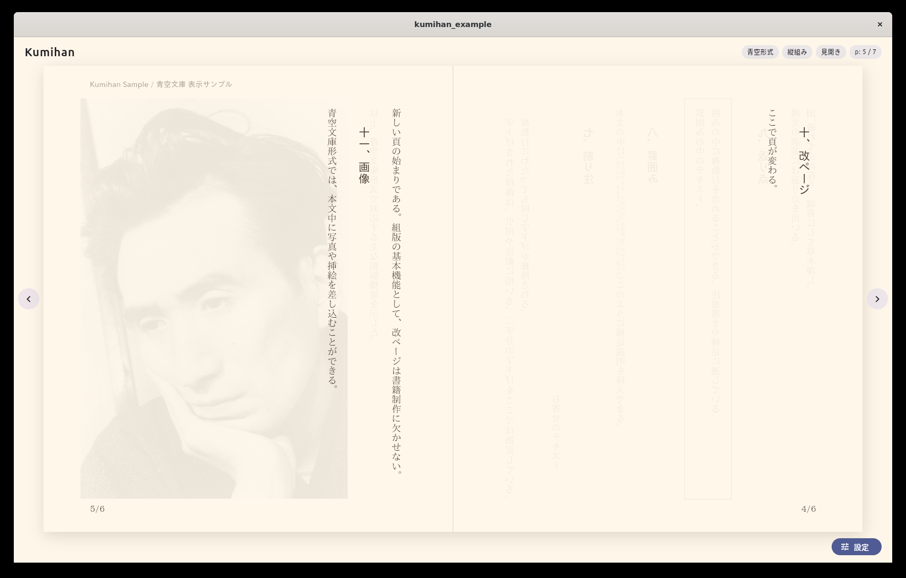
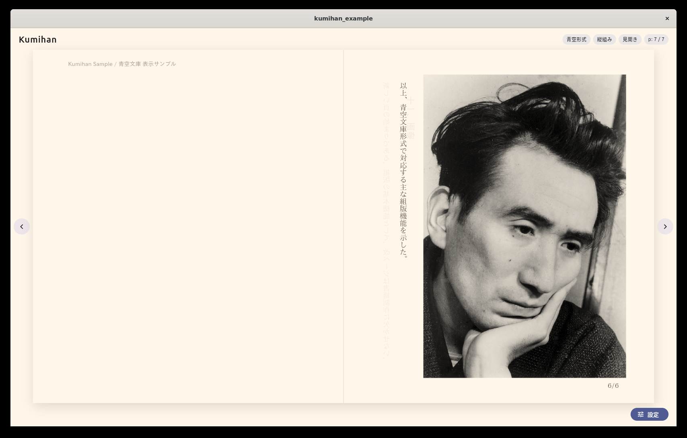
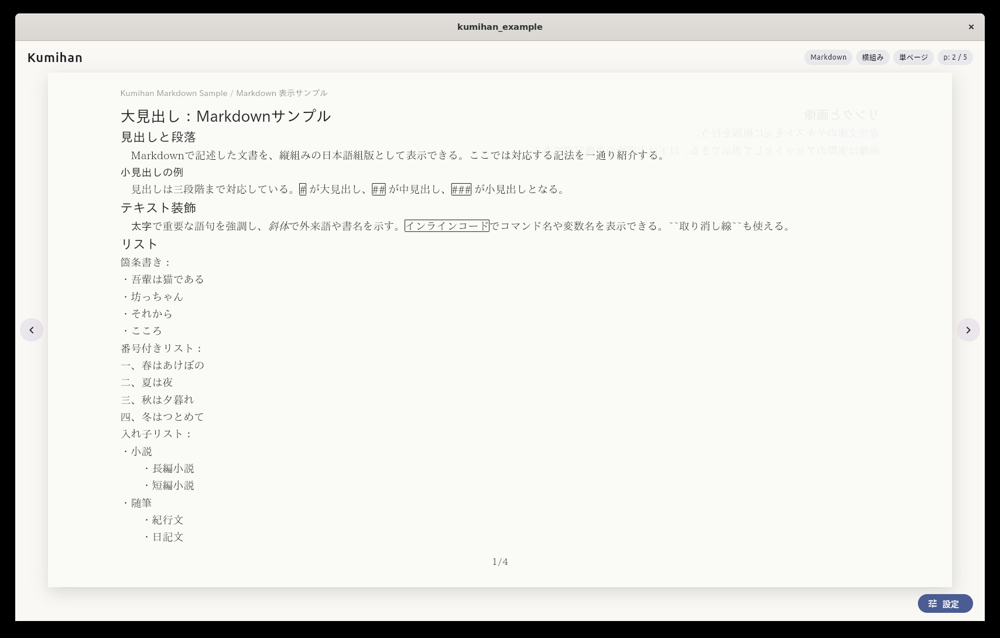
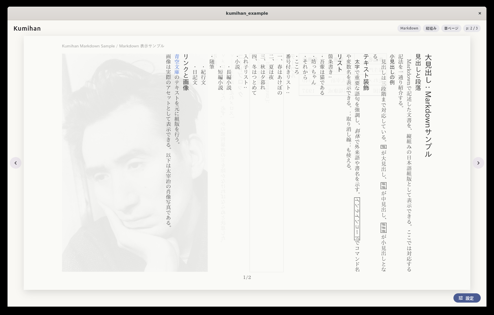
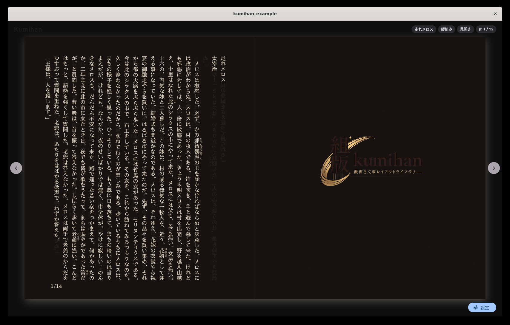
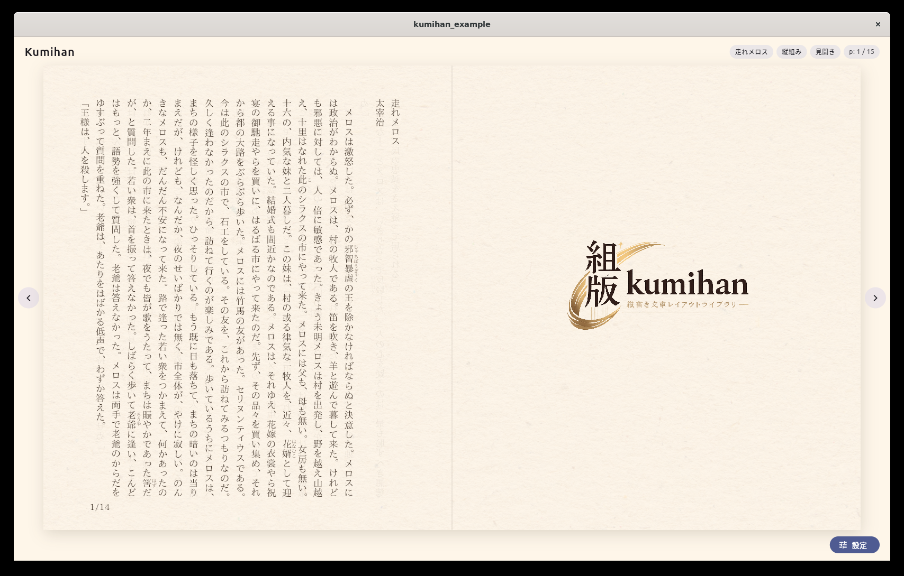

<p align="center">
  
</p>

<h1 align="center">組版 — kumihan</h1>

<p align="center">
  Flutter で日本語縦書きを、美しく。
</p>

<p align="center">

[](https://pub.dev/packages/kumihan)
[](https://pub.dev/packages/kumihan/score)
[](https://pub.dev/packages/kumihan/score)

[](LICENSE)
[](https://flutter.dev)

</p>

---

日本語組版ウィジェット。縦書き・横書き・見開き表示に対応。
青空文庫形式・Markdown・HTML をパースしてそのまま描画できる。

## v1 Development Note

`v1` ブランチは `main` から切り直し、`lib/src/engine` を基点に段階的に責務を切り出していく方針に変更した。
大きな置き換えは避け、動作を保ったまま小さく分離していく。開発メモは `docs/development_strategy.md` を参照。

## スクリーンショット

|                                                    |                                                  |
| :------------------------------------------------: | :----------------------------------------------: |
|               |             |
|               |             |
|  |  |
|         |  |

## 使い方

```dart
import 'package:kumihan/kumihan.dart';

final controller = KumihanController();
final document = AozoraParser().parse(aozoraText);

KumihanCanvas(
  controller: controller,
  document: document,
  layout: KumihanLayoutData(fontSize: 18),
  theme: KumihanThemeData.light(),
)
```

DSL 経由で一部分だけ色を変えることもできる。

```dart
final document = Document([
  '通常の本文と',
  TextColor(
    color: const Color(0xffd32f2f),
    children: ['赤文字'],
  ),
  'です。',
]);
```

## インストール

```yaml
dependencies:
  kumihan: ^0.0.1
```

## 対応フォーマット

- **青空文庫形式** — ルビ・傍点・注記
- **Markdown** — 見出し・リスト・強調
- **HTML** — 基本タグ

## ライセンス

MIT
