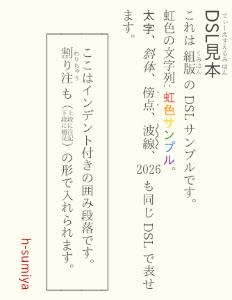
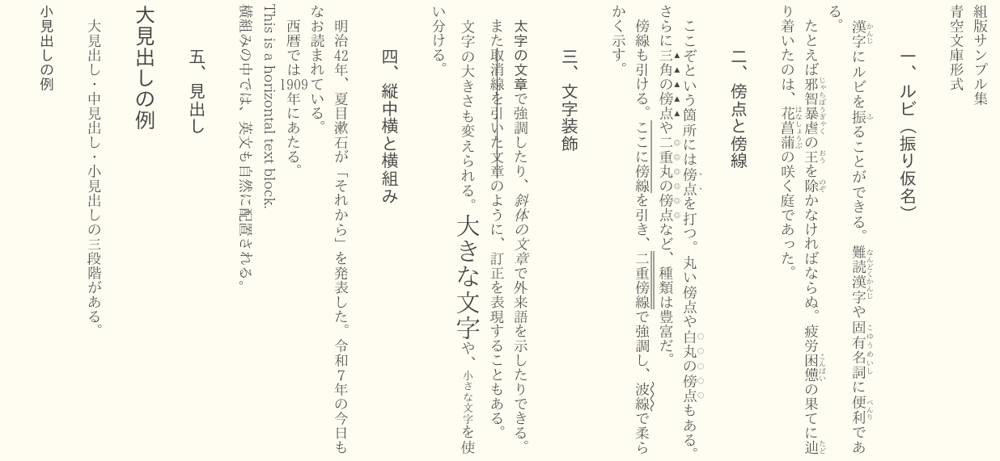
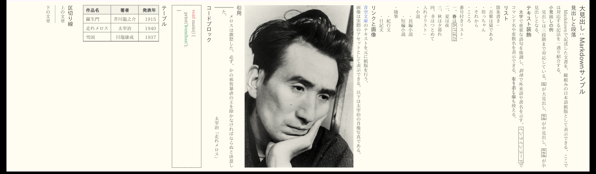

<p align="center">
  
</p>

<h1 align="center">組版 — kumihan</h1>

<p align="center">
  Flutterで日本語縦書きを、美しく。
</p>

<p align="center">

[](https://pub.dev/packages/kumihan)
[](https://pub.dev/packages/kumihan/score)
[](https://pub.dev/packages/kumihan/score)

[](LICENSE)
[](https://flutter.dev)

</p>

---

## 使い方

```dart
import 'package:kumihan/kumihan.dart';

final controller = KumihanController();

KumihanSinglePageView(
  controller: controller,
  document: document,
  layout: const KumihanLayoutData(fontSize: 18),
)
```

<details>

<summary>Flutterからドキュメントを作成する</summary>

```dart
Document([
  const Heading(
    level: AstHeadingLevel.large,
    children: [
      Text(value: 'DSL見本', ruby: ['でぃーえすえるみほん']),
    ],
  ),
  const Br(),
  const Text(value: 'これは '),
  const Text(value: '組版', ruby: ['くみはん']),
  const Text(value: ' の DSL サンプルです。'),
  const Br(),
  const Text(value: '虹色の文字列: '),
  const Text(value: '虹', color: Color(0xffe53935), bold: true),
  const Text(value: '色', color: Color(0xfffb8c00), bold: true),
  const Text(value: 'サ', color: Color(0xfffdd835), bold: true),
  const Text(value: 'ン', color: Color(0xff43a047), bold: true),
  const Text(value: 'プ', color: Color(0xff1e88e5), bold: true),
  const Text(value: 'ル', color: Color(0xff8e24aa), bold: true),
  const Text(value: '。'),
  const Br(),
  const Text(value: '太字', bold: true),
  const Text(value: '、'),
  const Text(value: '斜体', italic: true),
  const Text(value: '、'),
  const Text(value: '傍点', bouten: AstBoutenKind.sesame),
  const Text(value: '、'),
  const Text(value: '波線', border: AstBosenKind.wave),
  const Text(value: '、'),
  const Text(value: '2026', tatechuyoko: true),
  const Text(value: ' も同じ DSL で表せます。'),
  const Br(),
  Indent.block(
    lineIndent: 2,
    children: [
      Keigakomi(
        block: true,
        children: [
          Text(value: 'ここはインデント付きの囲み段落です。'),
          Br(),
          Text(value: '割り注', ruby: ['わりちゅう']),
          Text(value: ' も '),
          Warichu(text: '上段に注記\n下段に補足'),
          Text(value: ' の形で入れられます。'),
        ],
      ),
    ],
  ),
  const Br(),
  const BottomAlign.block(
    children: [
      Text(
        value: 'h-sumiya',
        color: Color.fromARGB(255, 195, 16, 16),
        bold: true,
      ),
    ],
  ),
]);
```



</details>

<details>

<summary>青空パーサーを利用する</summary>

```dart
const aozoraText = '''組版サンプル集
青空文庫形式

［＃３字下げ］一、ルビ（振り仮名）［＃「一、ルビ（振り仮名）」は中見出し］

　漢字《かんじ》にルビを振《ふ》ることができる。難読漢字《なんどくかんじ》や固有名詞《こゆうめいし》に便利《べんり》である。
　たとえば邪智暴虐《じゃちぼうぎゃく》の王《おう》を除《のぞ》かなければならぬ。疲労｜困憊《こんぱい》の果てに辿《たど》り着いたのは、｜花菖蒲《はなしょうぶ》の咲く庭であった。

［＃３字下げ］二、傍点と傍線［＃「二、傍点と傍線」は中見出し］

　ここぞという箇所には傍点［＃「傍点」に傍点］を打つ。丸い傍点や白丸の傍点［＃「白丸の傍点」に白丸傍点］もある。さらに三角の傍点［＃「三角の傍点」に黒三角傍点］や二重丸の傍点［＃「二重丸の傍点」に二重丸傍点］など、種類は豊富だ。
　傍線も引ける。ここに傍線［＃「ここに傍線」に傍線］を引き、二重傍線［＃「二重傍線」に二重傍線］で強調し、波線［＃「波線」に波線］で柔らかく示す。

［＃３字下げ］三、文字装飾［＃「三、文字装飾」は中見出し］

　［＃太字］太字の文章［＃太字終わり］で強調したり、［＃斜体］斜体の文章［＃斜体終わり］で外来語を示したりできる。
　また取消線を引いた文章［＃「取消線を引いた文章」に取消線］のように、訂正を表現することもある。
　文字の大きさも変えられる。［＃３段階大きな文字］大きな文字［＃大きな文字終わり］や、［＃２段階小さな文字］小さな文字［＃小さな文字終わり］を使い分ける。

［＃３字下げ］四、縦中横と横組み［＃「四、縦中横と横組み」は中見出し］

　明治42［＃「42」は縦中横］年、夏目漱石が「それから」を発表した。令和７［＃「７」は縦中横］年の今日もなお読まれている。
　西暦では1909［＃「1909」は縦中横］年にあたる。
［＃ここから横組み］
This is a horizontal text block.
横組みの中では、英文も自然に配置される。
［＃ここで横組み終わり］

［＃３字下げ］五、見出し［＃「五、見出し」は中見出し］

大見出しの例［＃「大見出しの例」は大見出し］

　大見出し・中見出し・小見出しの三段階がある。

小見出しの例［＃「小見出しの例」は小見出し］

　それぞれの見出しは、文書の構造を明確にする。

［＃３字下げ］六、字下げと地付き［＃「六、字下げと地付き」は中見出し］

［＃２字下げ］字下げされた段落は、引用や注釈に用いる。二字分の字下げをここでは指定している。複数行にわたっても同じ字下げが維持される。

［＃地から３字上げ］右寄せのテキスト

［＃３字下げ］七、割り注［＃「七、割り注」は中見出し］

　本文の中に［＃割り注］割り注は、本文より小さい文字で二行に分けて組まれる注釈である。古典的な日本語組版で多用された。［＃割り注終わり］このように補足説明を挿入できる。

［＃３字下げ］八、罫囲み［＃「八、罫囲み」は中見出し］

［＃ここから罫囲み］
罫囲みの中のテキスト。
囲みの中に複数行を含めることができる。注意書きや補足に適している。
［＃ここで罫囲み終わり］

［＃３字下げ］九、返り点［＃「九、返り点」は中見出し］

　漢文の訓読には返り点を用いる。
　国［＃レ］破れて山河在り、城春にして草木深し。

［＃３字下げ］十、改ページ［＃「十、改ページ」は中見出し］

　ここで頁が変わる。
［＃改ページ］
　新しい頁の始まりである。組版の基本機能として、改ページは書籍制作に欠かせない。

［＃３字下げ］十一、画像［＃「十一、画像」は中見出し］

　青空文庫形式では、本文中に写真や挿絵を差し込むことができる。
［＃太宰治の肖像写真（Osamu_Dazai.jpg、横815×縦1220）入る］

　以上、青空文庫形式で対応する主な組版機能を示した。
''';

const AozoraParser().parse(aozoraText)

```



</details>

<details>

<summary>マークダウンパーサーを利用する</summary>

````dart
const aozoraText = '''# 大見出し：Markdownサンプル

## 見出しと段落

　Markdownで記述した文書を、縦組みの日本語組版として表示できる。ここでは対応する記法を一通り紹介する。

### 小見出しの例

　見出しは三段階まで対応している。`#` が大見出し、`##` が中見出し、`###` が小見出しとなる。

## テキスト装飾

　**太字**で重要な語句を強調し、*斜体*で外来語や書名を示す。`インラインコード`でコマンド名や変数名を表示できる。~~取り消し線~~も使える。

## リスト

箇条書き：

- 吾輩は猫である
- 坊っちゃん
- それから
- こころ

番号付きリスト：

1. 春はあけぼの
2. 夏は夜
3. 秋は夕暮れ
4. 冬はつとめて

入れ子リスト：

- 小説
  - 長編小説
  - 短編小説
- 随筆
  - 紀行文
  - 日記文

## リンクと画像

[青空文庫](https://www.aozora.gr.jp/)のテキストを元に組版を行う。

画像は実際のアセットとして表示できる。以下は太宰治の肖像写真である。


## 引用

> 　メロスは激怒した。必ず、かの邪智暴虐の王を除かなければならぬと決意した。
>
> ――太宰治「走れメロス」

## コードブロック

```
void main() {
  print('kumihan');
}
```

## テーブル

| 作品名     |    著者    | 発表年 |
| :--------- | :--------: | -----: |
| 羅生門     | 芥川龍之介 |   1915 |
| 走れメロス |   太宰治   |   1940 |
| 雪国       |  川端康成  |   1937 |

## 区切り線

上の文章

---

下の文章
''';

const AozoraParser().parse(aozoraText)

````



</details>

## インストール

```yaml
dependencies:
  kumihan: ^0.0.1
```

## 対応フォーマット

- **青空文庫形式**
- **Markdown**
- **HTML**

独自のパーサーを実装することで、他のフォーマットも描画できるようになる。

## ライセンス

MIT
